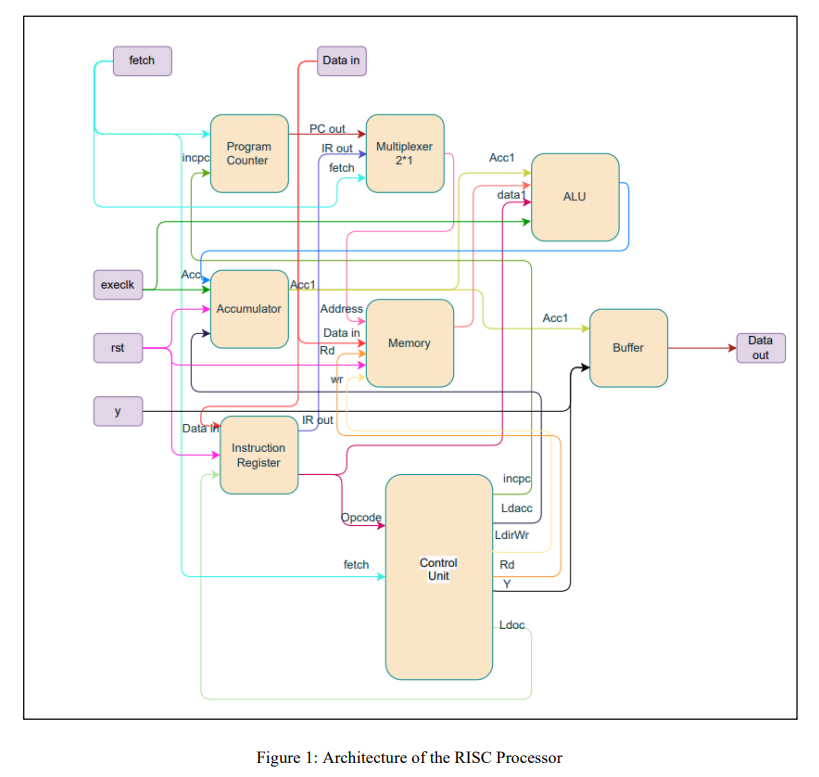

# 32-Bit RISC Processor using Verilog

This project presents a 32-bit RISC processor with a memory controller, completed as a 3rd-year group project for the HDL module at the University of Ruhuna, SL. The processor features a streamlined architecture for faster execution times, utilizing Verilog HDL for implementation and ModelSim for simulation.

## Project Overview

The project aimed to design and implement a Reduced Instruction Set Computing (RISC) processor with a memory controller. The processor is equipped with 15 essential instructions covering arithmetic, logical, data transfer, and control operations. Key components include the Control Unit (CU), Arithmetic and Logic Unit (ALU), Accumulator, Program Counter (PC), Instruction Register (IR), Memory Module, and additional logic blocks.

## Repository Contents

- `Project_Report.pdf`: Detailed project report.
- `Verilog_Implementation/`: Verilog HDL code for each module of the RISC processor.
  - `Accumulator.v`
  - `ALU.v`
  - `Buffer.v`
  - `Control_Unit.v`
  - `Instruction_Register.v`
  - `Memory_Module.v`
  - `MUX.v`
  - `Program_Counter.v`
  - `Processor.v`
- `Testing_and_Verification/`: Test bench results for each module.

##  Architecture of the RISC Processor

 

## How to Use

1. Clone the repository:
`git clone https://github.com/sahanrashmikaslk/HDL-32bit_RISC_Processor.git`

2. Navigate to the `Verilog_Implementation/` directory to access the Verilog code for each module.

3. Open the Verilog files in a suitable development environment (e.g., Modelslim Vivado, Quartus Prime) for synthesis and simulation.

4. Explore the `Project_Report.pdf` for a comprehensive overview of the project, including design rationale, methodology, and results.

## Contributors

- Sahan Lelwala
- Sanjula Lakpahana
- Dushmin Malisha
  
